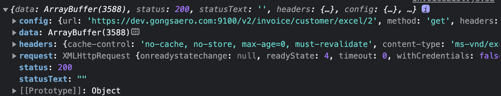

# 39-DOM

<mark style="color:purple;">**DOM(Document Object Model)은 HTML 문서의 계층적 구조와 정보를 표현하며 이를 제어할 수 있는 API, 즉 프로퍼티와 메서드를 제공하는 트리 자료구조**</mark>다.

## 39.1 노드

### 39.1.1 HTML 요소와 노드 객체

HTML 요소는 HTML 문서를 구성하는 개별적인 요소를 의미한다.

<figure><figcaption></figcaption></figure>

HTML 요소는 렌더링 엔진에 의해 파싱되어 DOM을 구성하는 요소 노드 객체로 변환된다. 이때 HTML 요소의 어트리뷰트는 어트리뷰트 노드로, 텍스트 콘텐츠는 텍스트 노드로 변환된다.

<figure><figcaption></figcaption></figure>

HTML 문서는 HTML 요소들의 집합으로 이뤄지며, HTML 요소는 중첩 관계를 갖는다. 즉, HTML 요소의 콘텐츠 영역에는 텍스트뿐만 아니라 다른 HTML 요소도 포함할 수 있다.

이때 HTML 요소 간에는 중첩 관계에 의해 계층적인 부자 관계가 형성된다. 이러한 HTML 요소 간의 부자 관계를 반영하여 HTML 문서의 구성 요소인 HTML 요소를 객체화한 모든 노드 객체들을 트리 자료구조로 구성한다.

트리 자료구조

트리 자료구조(tree data structure)는 노드들의 계층 구조로 이뤄진다. 즉, 트리 자료구조는 부모 노드와 자식 노드로 구성되어 노드 간의 계층적 구조(부자, 형제 관계)를 표현하는 비선형 자료구조를 말한다. 트리 자료구조는 하나의 최상위 노드에서 시작한다. 최상위 노드는 부모 노드가 없으며, 루트 노드라 칭한다. 루트 노드는 0개 이상의 자식 노드를 갖는다. 자식 노드가 없는 노드를 리프 노드라 한다.

<figure><figcaption></figcaption></figure>

<mark style="color:purple;">**노드 객체들로 구성된 트리 자료구조를 DOM**</mark>이라 한다. 노드 객체의 트리로 구조화되어 있기 때문에 <mark style="color:purple;">**DOM 트리**</mark>라고 부르기도 한다.

### 39.1.2 노드 객체의 타입

예를 들어, 다음 HTML 문서를 렌더링 엔진이 파싱한다고 생각해보자.

```html
<!DOCTYPE html>
<html>
    <head>
        <meta charset="UTF-8">
        <link rel="stylesheet" href="style.css">
    </head>
    <body>
        <ul>
            <li id="apple">Apple</li>
            <li id="banana">Banana</li>
            <li id="orange">Orange</li>
        </ul>
        <script src="app.js"></script>
    </body>
</html>
```

렌더링 엔진은 위 HTML 문서를 파싱하여 다음과 같이 DOM을 생성한다.

<figure><figcaption></figcaption></figure>

이처럼 DOM은 노드 객체의 계층적인 구조로 구성된다. 노드 객체는 종류가 있고 상속 구조를 갖는다.

<mark style="color:green;">**문서 노드(document node)**</mark>

문서 노드는 DOM 트리의 최상위에 존재하는 루트 노드로서 document 객체를 가리킨다. document 객체는 브라우저가 렌더링한 HTML 문서 전체를 가리키는 객체로서 전역 객체 window의 document 프로퍼티에 바인딩되어 있다. 따라서 문서 노드는 window.document 또는 document로 참조할 수 있다.

브라우저 환경의 모든 자바스크립트 코드는 script 태그에 의해 분리되어 있어도 하나의 전역 객체 window를 공유한다. 따라서 모든 자바스크립트 코드는 전역 객체 window의 document 프로퍼티에 바인딩되어 있는 하나의 document 객체를 바라본다. 즉, HTML 문서당 document 객체는 유일하다.

문서 노드, 즉 document 객체는 DOM 트리의 루트 노드이므로 DOM 트리의 노드들에 접근하기 위한 진입점(entry point) 역할을 담당한다. 즉, 요소, 어트리뷰트, 텍스트 노드에 접근하려면 문서 노드를 통해야 한다.

<mark style="color:green;">**요소 노드(element node)**</mark>

요소 노드는 HTML 요소를 가리키는 객체다. 요소 노드는 HTML 요소 간의 중첩에 의해 부자 관계를 가지며, 이 부자 관계를 통해 정보를 구조화한다. 따라서 요소 노드는 문서의 구조를 표현한다고 할 수 있다.

<mark style="color:green;">**어트리뷰트 노드(attribute node)**</mark>

어트리뷰트 노드는 HTML 요소의 어트리뷰트를 가리키는 객체다. 어트리뷰트 노드는 어트리뷰트가 지정된 HTML 요소의 요소 노드와 연결되어 있다. 단, 요소 노드는 부모 노드와 연결되어 있지만 어트리뷰트 노드는 부모 노드와 연결되어 있지 않고 요소 노드에만 연결되어 있다. 즉, 어트리뷰트 노드는 부모 노드가 없으므로 요소 노드의 형제(sibling) 노드는 아니다. 따라서 어트리뷰트 노드에 접근하여 어트리뷰트를 참조하거나 변경하려면 먼저 요소 노드에 접근해야 한다.

텍스트 노드(text node)

텍스트 노드는 HTML 요소의 텍스트를 가리키는 객체다. 요소 노드가 문서의 구조를 표현한다면 텍스트 노드는 문서의 정보를 표현한다고 할 수 있다. 텍스트 노드는 요소 노드의 자식 노드이며, 자식 노드를 가질 수 없는 리프 노드(leaf node)이다. 즉, 텍스트 노드는 DOM 트리의 최종단이다. 따라서 텍스트 노드에 접근하려면 먼저 부모 노드인 요소 노드에 접근해야 한다.

### 39.1.3 노드 객체의 상속 구조

DOM은 HTML 문서의 계층적 구조와 정보를 표현하며, 이를 제어할 수 있는 API, 즉 프로퍼티와 메서드를 제공하는 트리 자료구조라고 했다. 즉, DOM을 구성하는 노드 객체는 자신의 구조와 정보를 제어할 수 있는 DOM API를 사용할 수 있다. 이를 통해 노드 객체는 자신의 부모, 형제, 자식을 탐색할 수 있으며, 자신의 어트리뷰트와 텍스트를 조작할 수도 있다.

DOM을 구성하는 노드 객체는 ECMAScript 사양에 정의된 표준 빌트인 객체가 아니라 브라우저 환경에서 추가적으로 제공하는 호스트 객체다. 하지만 노드 객체도 자바스크립트 객체이므로 프로토타입에 의한 상속 구조를 갖는다. 노드 객체의 상속 구조는 다음과 같다.

<figure><figcaption></figcaption></figure>

위 그림과 같이 모든 노드 객체는 Object, EventTarget, Node 인터페이스를 상속받는다. 추가적으로 문서 노드는 Document, HTMLDocument 인터페이스를 상속받고 어트리뷰트 노드는 Attr, 텍스트 노드는 CharacterData 인터페이스를 각각 상속받는다.

요소 노드는 Element 인터페이스를 상속받는다. 또한 요소 노드는 추가적으로 HTMLElement와 태그의 종류별로 세분화된 HTMLHtmlElement, HTMLHeadElement 등의 인터페이스를 상속받는다.

이를 프로토타입 체인 관점에서 살펴보자. 예를 들어, input 요소를 파싱하여 객체화한 input 요소 노드 객체는 HTMLInputElement, HTMLElement, Element, Node, EventTarget, Object의 prototype에 바인딩되어 있는 프로토타입 객체를 상속받는다. 즉, input 요소 노드 객체는 프로토타입 체인에 있는 모든 프로토타입의 프로퍼티나 메서드를 상속받아 사용할 수 있다.

<figure><figcaption></figcaption></figure>

```html
<!DOCTYPE html>
<html>
    <body>
        <input type="text">
        <script>
            // input 요소 노드 객체를 선택
            const $input = document.querySelector('input');

            // input 요소 노드 객체의 프로토타입 체인
            console.log(
                Object.getPrototypeOf($input) === HTMLInputElement.prototype,
                Object.getPrototypeOf(HTMLInputElement.prototype) === HTMLElement.prototype,
                Object.getPrototypeOf(HTMLElement.prototype) === Element.prototype,
                Object.getPrototypeOf(Element.prototype) === Node.prototype,
                Object.getPrototypeOf(Node.prototype) === EventTarget.prototype,
                Object.getPrototypeOf(EventTarget.prototype) === Object.prototype
            ); // 모두 true
        </script>
    </body>
</html>
```

배열이 객체인 동시에 배열인 것처럼 input 요소 노드 객체도 다음과 같이 다양한 특성을 갖는 객체이며, 이러한 특성을 나타내는 기능들을 상속을 통해 제공받는다.

|                 input 요소 노드 객체의 특성                |  프로토타입을 제공하는 객체  |
| :-----------------------------------------------: | :--------------: |
|                         객체                        |      Object      |
|                   이벤트를 발생시키는 객체                   |    EventTarget   |
|                   트리 자료구조의 노드 객체                  |       Node       |
| 브라우저가 렌더링할 수 있는 웹 문서의 요소(HTML, XML, SVG)를 표현하는 객체 |      Element     |
|           웹 문서의 요소 중에서 HTML 요소를 표현하는 객체           |    HTMLElement   |
|           HTML 요소 중에서 input 요소를 표현하는 객체           | HTMLInputElement |

노드 객체에는 노드 객체의 종류, 즉 노드 타입에 상관없이 모든 노드 객체가 공통으로 갖는 기능도 있고, 노드 타입에 따라 고유한 기능도 있다. 예를 들어, 모든 노드 객체는 공통적으로 이벤트를 발생시킬 수 있다.

이벤트에 관련된 기능(EventTarget.addEventListener 등)은 EventTarget 인터페이스가 제공한다. 또한 모든 노드 객체는 트리 자료구조의 노드로서 공통적으로 트리 탐색 기능(Node.parentNode 등)이나 노드 정보 제공 기능(Node.nodeType 등)이 필요하다. 이 같은 노드 관련 기능은 Node 인터페이스가 제공한다.

HTML 요소가 객체화된 요소 노드 객체는 HTML 요소가 갖는 공통적인 기능이 있다. 예를 들어, input 요소 객체와 div 요소 객체는 모두 HTML 요소의 스타일을 나타내는 style 프로퍼티가 있다. 이처럼 HTML 요소가 갖는 공통적인 기능은 HTMLElement 인터페이스가 제공한다.

하지만 요소 노드 객체는 HTML 요소의 종류에 따라 고유한 기능도 있다. 예를 들어, input 요소 노드 객체는 value 프로퍼티가 필요하지만 div 요소 노드 객체는 value 프로퍼티가 필요하지 않다. 따라서 필요한 기능을 제공하는 인터페이스(HTMLInputElement, HTMLDivElement)가 HTML 요소의 종류에 따라 각각 다르다.

이처럼 노드 객체는 공통된 기능일수록 프로토타입 체인의 상위에, 개별적인 고유 기능일수록 프로토타입 체인의 하위에 프로토타입 체인을 구축하여 노드 객체에 필요한 기능, 즉 프로퍼티와 메서드를 제공하는 상속 구조를 갖는다.

지금까지 살펴본 바와 같이 <mark style="color:purple;">**DOM은 HTML 문서의 계층적 구조와 정보를 표현하는 것은 물론 노드 객체의 종류, 즉 노드 타입에 따라 필요한 기능을 프로퍼티와 메서드의 집합인 DOM API로 제공한다. 이 DOM API를 통해 HTML의 구조나 내용 또는 스타일 등을 동적으로 조작할 수 있다.**</mark>

## 39.2 요소 노드 취득

HTML의 구조나 내용 또는 스타일 등을 동적으로 조작하려면 먼저 요소 노드를 취득해야 한다. 텍스트 노드는 요소 노드의 자식 노드이고, 어트리뷰트 노드는 요소 노드와 연결되어 있기 때문에 텍스트 노드나 어트리뷰트 노드를 조작하고자 할 때도 마찬가지다.

### 39.2.1 id를 이용한 요소 노드 취득

Document.prototype.getElementById 메서드는 인수로 전달한 id 어트리뷰트 값을 갖는 하나의 요소 노드를 탐색하여 반환한다.

```html
<!DOCTYPE html>
<html>
    <body>
        <ul>
            <li id="apple">Apple</li>
            <li id="banana">Banana</li>
            <li id="orange">Orange</li>
        </ul>
        <script>
            // id 값이 'banana'인 요소 노드를 탐색하여 반환한다.
            // 두 번째 li 요소가 파싱되어 생성된 요소 노드가 반환된다.
            const $elem = document.getElementById('banana');

            // 취득한 요소 노드의 style.color 프로퍼티 값을 변경한다.
            $elem.style.color = 'red';
        </script>
    </body>
</html>
```

id 값은 HTML 문서 내에서 유일한 값이어야 하며, class 어트리뷰트와는 달리 공백 문자로 구분하여 여러 개의 값을 가질 수 없다.

```html
<!DOCTYPE html>
<html>
    <body>
        <ul>
            <li id="banana">Apple</li>
            <li id="banana">Banana</li>
            <li id="banana">Orange</li>
        </ul>
        <script>
            // getElementById 메소드는 언제나 단 하나의 요소 노드를 반환한다.
            // 첫 번째 li 요소가 파싱되어 생성된 요소 노드가 반환된다.
            const $elem = document.getElementById('banana');

            // 취득한 요소 노드의 style.color 프로퍼티 값을 변경한다.
            $elem.style.color = 'red';
        </script>
    </body>
</html>
```

만약 인수로 전달된 id 값을 갖는 HTML 요소가 존재하지 않는 경우 getElementById 메서드는 null을 반환한다.

```html
<!DOCTYPE html>
<html>
    <body>
        <ul>
            <li id="apple">Apple</li>
            <li id="banana">Banana</li>
            <li id="orange">Orange</li>
        </ul>
        <script>
            // id 값이 'grape'인 요소 노드를 탐색하여 반환한다. null이 반환된다.
            const $elem = document.getElementById('grape');

            // 취득한 요소 노드의 style.color 프로퍼티 값을 변경한다.
            $elem.style.color = 'red'; // TypeError: Cannot read properties of null (reading 'style')
        </script>
    </body>
</html>
```

HTML 요소에 id 어트리뷰트를 부여하면 id 값과 동일한 이름의 전역 변수가 암묵적으로 선언되고 해당 노드 객체가 할당되는 부수 효과가 있다.

```html
<!DOCTYPE html>
<html>
    <body>
        <div id="foo"></div>
        <script>
            // id 값과 동일한 이름의 전역 변수가 암묵적으로 선언되고 해당 노드 객체가 할당된다.
            console.log(foo === document.getElementById('foo')); // true

            // 암묵적 전역으로 생성된 전역 프로퍼티는 삭제되지만 전역 변수는 삭제되지 않는다.
            delete foo;
            console.log(foo); // <div id="foo"></div>
        </script>
    </body>
</html>
```

단, id 값과 동일한 이름의 전역 변수가 이미 선언되어 있으면 이 전역 변수에 노드 객체가 재할당되지 않는다.

```html
<!DOCTYPE html>
<html>
    <body>
        <div id="foo"></div>
        <script>
            let foo = 1;

            // id 값과 동일한 이름의 전역 변수가 이미 선언되어 있으면 노드 객체가 재할당되지 않는다.
            delete foo;
            console.log(foo); // 1
        </script>
    </body>
</html>
```

### 39.2.2 태그 이름을 이용한 요소 노드 취득

Document.prototype.getElementsByTagName 메서드는 인수로 전달한 태그 이름을 갖는 모든 요소 노드들을 탐색하여 반환한다.

```html
<!DOCTYPE html>
<html>
    <body>
        <ul>
            <li id="apple">Apple</li>
            <li id="banana">Banana</li>
            <li id="orange">Orange</li>
        </ul>
        <script>
            // 태그 이름이 li인 요소 노드를 모두 탐색하여 반환한다.
            // 탐색된 요소 노드들은 HTMLCollection 객체에 담겨 반환된다.
            // HTMLCollection 객체는 유사 배열 객체이면서 이터러블이다.
            const $elems = document.getElementsByTagName('li');

            // 취득한 요소 노드의 style.color 프로퍼티 값을 변경한다.
            // HTMLCollection 객체를 배열로 변환하여 순회하며 color 프로퍼티 값을 변경한다.
            [...$elems].forEach(elem => { elem.style.color = 'red'; });
        </script>
    </body>
</html>
```

함수는 하나의 값만 반환할 수 있으므로 여러 개의 값을 반환하려면 배열이나 객체와 같은 자료구조에 담아 반환해야 한다. getElementsByTagName 메서드가 반환하는 DOM 컬렉션 객체인 HTMLCollection 객체는 유사 배열 객체이면서 이터러블이다.

HTML 문서의 모든 요소 노드를 취득하려면 getElementsByTagName 메서드의 인수로 '\*'를 전달한다.

```javascript
// 모든 요소 노드를 탐색하여 반환한다.
const $all = document.getElementsByTagName('*');
// -> HTMLCollection(8) [html, head, body, ul, li#apple, li#banana, li#orange,
// script, apple:li#apple, banana:li#banana, orange:li#orange]
```

getElementsByTagName 메서드는 Document.prototype에 정의된 메서드와 Element.prototype에 정의된 메서드가 있다.

* Document: DOM의 루트 노드인 문서 노드, 즉 document를 통해 호출하여 DOM 전체에서 요소 노드를 탐색하여 반환.
* Element: 특정 요소 노드를 통해 호출하며, 특정 요소 노드의 자손 노드 중에서 요소 노드를 탐색하여 반환.

```html
<!DOCTYPE html>
<html>
    <body>
        <ul id="fruits">
            <li id="apple">Apple</li>
            <li id="banana">Banana</li>
            <li id="orange">Orange</li>
        </ul>
        <ul>
            <li>HTML</li>
        </ul>
        <script>
            // DOM 전체에서 태그 이름이 li인 요소 노드를 모두 탐색하여 반환한다.
            const $lisFromDocument = document.getElementsByTagName('li');
            console.log($lisFromDocument) // HTMLCollection(4) [li, li, li, li]

            // ul#fruits 요소의 자손 노드 중에서 태그 이름이 li인 요소 노드를 모두 탐색하여 반환한다.
            const $fruits = document.getElementById('fruits');           
            const $lisFromFruits = $fruits.getElementsByTagName('li');
            console.log($lisFromFruits); // HTMLCollection(3) [li, li, li]
        </script>
    </body>
</html>
```

만약 인수로 전달된 태그 이름을 갖는 요소가 존재하지 않는 경우 빈 HTMLCollection 객체를 반환한다.

### 39.2.3 class를 이용한 요소 노드 취득

Document.prototype.getElementsByClassName 메서드는 인수로 전달한 class 어트리뷰트 값을 갖는 모든 요소들을 탐색하여 반환한다. 인수로 전달할 class 값은 공백으로 구분하여 여러 개의 class를 지정할 수 있다.

```html
<!DOCTYPE html>
<html>
    <body>
        <ul>
            <li class="fruit apple">Apple</li>
            <li class="fruit banana">Banana</li>
            <li class="fruit orange">Orange</li>
        </ul>
        <script>
            // class 값이 'fruit'인 요소 노드를 모두 탐색하여 HTMLCollection 객체에 담아 반환한다.
            const $elems = document.getElementsByClassName('fruit');

            // 취득한 모든 요소의 CSS color 프로퍼티 값을 변경한다.
            [...$elems].forEach(elem => { elem.style.color = 'red' });
            
            // class 값이 'fruit apple'인 요소 노드를 모두 탐색하여 HTMLCollection 객체에 담아 반환한다.
            const $apples = document.getElementsByClassName('fruit apple');
            
            // 취득한 모든 요소의 style.color 프로퍼티 값을 변경한다.
            [...$apples].forEach(elem => { elem.style.color = 'blue' });
        </script>
    </body>
</html>
```

getElementsByClassName 메서드는 Document.prototype에 정의된 메서드와 Element.prototype에 정의된 메서드가 있다.

* Document: DOM의 루트 노드인 문서 노드, 즉 document를 통해 호출하여 DOM 전체에서 요소 노드를 탐색하여 반환.
* Element: 특정 요소 노드를 통해 호출하며, 특정 요소 노드의 자손 노드 중에서 요소 노드를 탐색하여 반환.

```html
<!DOCTYPE html>
<html>
    <body>
        <ul id="fruits">
            <li class="apple">Apple</li>
            <li class="banana">Banana</li>
            <li class="orange">Orange</li>
        </ul>
        <div class="banana">Banana</div>
        <script>
            // DOM 전체에서 class 값이 'banana'인 요소 노드를 모두 탐색하여 반환한다.
            const $bananasFromDocument = document.getElementsByClassName('banana');
            console.log($bananasFromDocument)
            // HTMLCollection(2) [li.banana, div.banana]

            // #fruits 요소의 자손 노드 중에서 class 값이 'banana'인 요소 노드를 모두 탐색하여 반환한다.
            const $fruits = document.getElementById('fruits');
            const $bananasFromFruits = $fruits.getElementsByClassName('banana');
            console.log($bananasFromFruits);
            // HTMLCollection [li.banana]
        </script>
    </body>
</html>
```

만약 인수로 전달된 class 값을 갖는 요소가 존재하지 않는 경우 빈 HTMLCollection 객체를 반환한다.

### 39.2.4 CSS 선택자를 이용한 요소 노드 취득

CSS 선택자는 스타일을 적용하고자 하는 HTML 요소를 특정할 때 사용하는 문법이다.

```css
/* 전체 선택자: 모든 요소를 선택 */
* { ... }
/* 태그 선택자: 모든 p 태그 요소를 모두 선택 */
p { ... }
/* id 선택자: id 값이 'foo'인 요소를 모두 선택 */
#foo { ... }
/* class 선택자: class 값이 'foo'인 요소를 모두 선택 */
.foo { ... }
/* 어트리뷰트 선택자: input 요소 중에 type 어트리뷰트 값이 'text'인 요소를 모두 선택 */
input[type=text] { ... }
/* 후손 선택자: div 요소의 후손 요소 중 p 요소를 모두 선택 */
div p { ... }
/* 자식 선택자: div 요소의 자식 요소 중 p 요소를 모두 선택 */
div > p { ... }
/* 인접 형제 선택자: p 요소의 형제 요소 중에 p 요소 바로 뒤에 위치하는 ul 요소를 선택*/
p + ul { ... }
/* 일반 형제 선택자: p 요소의 형제 요소 중에 p 요소 뒤에 위치하는 ul 요소를 모두 선택*/
p ~ ul { ... }
/* 가상 클래스 선택자: hover 상태인 a 요소를 모두 선택 */
a:hover { ... }
/* 가상 요소 선택자: p 요소의 콘텐츠의 앞에 위치하는 공간을 선택 */
/* 일반적으로 content 프로퍼티와 함께 사용된다. */
p::before { ... }
```

Document.prototype.querySelector 메서드는 인수로 전달한 CSS 선택자를 만족시키는 하나의 요소 노드를 탐색하여 반환한다.

```html
<!DOCTYPE html>
<html>
    <body>
        <ul>
            <li class="apple">Apple</li>
            <li class="banana">Banana</li>
            <li class="orange">Orange</li>
        </ul>
        <script>
            // class 어트리뷰트 값이 'banana'인 첫 번째 요소 노드를 탐색하여 반환한다.
            const $elem = document.querySelector('.banana');

            // 취득한 요소 노드의 style.color 프로퍼티 값을 변경한다.
            $elem.style.color = 'red';
        </script>
    </body>
</html>
```

Document.prototype.querySelectorAll 메서드는 인수로 전달한 CSS 선택자를 만족시키는 모든 요소 노드를 탐색하여 반환한다.

querySelectorAll 메서드는 여러 개의 요소 노드 객체를 갖는 DOM 컬렉션 객체인 NodeList 객체를 반환한다.

```html
<!DOCTYPE html>
<html>
    <body>
        <ul>
            <li class="apple">Apple</li>
            <li class="banana">Banana</li>
            <li class="orange">Orange</li>
        </ul>
        <script>
            // ul 요소의 자식 요소인 li 요소를 모두 탐색하여 반환한다.
            const $elems = document.querySelectorAll('ul > li');
            // 취득한 요소 노드들은 Nodelist 객체에 담겨 반환된다.
            console.log($elems); // NodeList(3) [li.apple, li.banana, li.orange]

            // 취득한 모든 요소 노드의 style.color 프로퍼티 값을 변경한다.
            // NodeList는 forEach 메소드를 제공한다.
            $elems.forEach(elem => { elem.style.color = 'red'; });
        </script>
    </body>
</html>
```

HTML 문서의 모든 요소 노드를 취득하려면 querySelectorAll 메서드의 인수로 전체 선택자 '\*'를 전달한다.

```javascript
// 모든 요소 노드를 탐색하여 반환한다.
const $all = document.querySelectorAll('*');
// -> NodeList(8) [html, head, body, ul, li#apple, li#banana, li#orange, script]
```

querySelector, querySelectorAll 메서드는 Document.prototype에 정의된 메서드와 Element.prototype에 정의된 메서드가 있다.

* Document: DOM의 루트 노드인 문서 노드, 즉 document를 통해 호출하여 DOM 전체에서 요소 노드를 탐색하여 반환.
* Element: 특정 요소 노드를 통해 호출하며, 특정 요소 노드의 자손 노드 중에서 요소 노드를 탐색하여 반환.

### 39.2.5 특정 요소 노드를 취득할 수 있는지 확인

Element.prototype.matches 메서드는 인수로 전달한 CSS 선택자를 통해 특정 요소 노드를 취득할 수 있는지 확인한다. 이벤트 위임을 사용할 때 유용하다.

```html
<!DOCTYPE html>
<html>
    <body>
        <ul id="fruits">
            <li class="apple">Apple</li>
            <li class="banana">Banana</li>
            <li class="orange">Orange</li>
        </ul>
    </body>
    <script>
        const $apple = document.querySelector('.apple');

        // $apple 노드는 '#fruits > li.apple'로 취득할 수 있다.
        console.log($apple.matches('#fruits > li.apple')); // true

        // $apple 노드는 '#fruits > li.banana'로 취득할 수 없다.
        console.log($apple.matches('#fruits > li.banana')); // false
    </script>
</html>
```

### 39.2.6 HTMLCollection과 NodeList

DOM 컬렉션 객체인 HTMLCollection과 NodeList는 DOM API가 여러 개의 결과값을 반환하기 위한 DOM 컬렉션 객체다. HTMLCollection과 NodeList는 모두 유사 배열 객체이면서 이터러블이다. 따라서 for...if 문으로 순회할 수 있으며 스프레드 문법을 사용하여 간단히 배열로 변환할 수 있다.

HTMLCollection과 NodeList의 중요한 특징은 노드 객체의 상태 변화를 실시간으로 반영하는 <mark style="color:purple;">**살아 있는 객체**</mark>라는 것이다. HTMLCollection은 언제나 live 객체로 동작한다. 단, NodeList는 대부분의 경우 노드 객체의 상태 변화를 실시간으로 반영하지 않고 과거의 정적 상태를 유지하는 non-live 객체로 동작하지만 경우에 따라 live 객체로 동작할 때가 있다.

<mark style="color:green;">**HTMLCollection**</mark>

getElementsByTagName, getElementsByClassName 메서드가 반환하는 HTMLCollection 객체는 노드 객체의 상태 변화를 실시간으로 반영하는 살아 있는 DOM 컬렉션 객체다. 따라서 이를 살아 있는 객체라고 부르기도 한다.

<mark style="color:green;">**NodeList**</mark>

HTMLCollection 객체의 부작용을 해결하기 위해 querySelectorAll 메서드를 사용하는 방법도 있다. 이 메서드가 반환하는 NodeList 객체는 실시간으로 노드 객체의 상태 변경을 반영하지 않는다.

<mark style="color:purple;">**노드 객체의 상태 변경과 상관없이 안전하게 DOM 컬렉션을 사용하려면 HTMLCollection이나 NodeList 객체를 배열로 변환하여 사용하는 것을 권장**</mark>한다.

## 39.3 노드 탐색

요소 노드를 취득한 다음, 취득한 요소를 기점으로 DOM 트리의 노드를 옮겨 다니며 부모, 형제, 자식 노드 등을 탐색해야 할 때가 있다.

```html
<ul id="fruits">
    <li class="apple">Apple</li>
    <li class="banana">Banana</li>
    <li class="orange">Orange</li>
</ul>
```

ul#fruits 요소는 3개의 자식 요소를 갖는다. 이때 먼저 ul#fruits 요소 노드를 취득한 다음, 자식 노드를 모두 탐색하거나 하나만 탐색할 수 있다. li.banana 요소는 2개의 형제 요소와 부모 요소를 갖는다. 이때 먼저 li.banana 요소 노드를 취득한 다음, 형제 노드를 탐색하거나 부모 노드를 탐색할 수 있다.

이처럼 DOM 트리 상의 노드를 탐색할 수 있도록 Node, Element 인터페이스는 트리 탐색 프로퍼티를 제공한다.

* Node.prototype: parentNode, previousSibling, nextSibling, firstChild, lastChild, childNodes 프로퍼티 제공
* Element.prototype: previousElementSibling, nextElementSibling, firstElementChild, lastElementChild, children 프로퍼티 제공

<figure><figcaption></figcaption></figure>

### 39.3.1 공백 텍스트 노드

HTML 요소 사이의 스페이스, 탭, 개행 등의 공백(white space) 문자는 텍스트 노드를 생성한다. 이를 공백 텍스트 노드라 한다.

```html
<!DOCTYPE html>
<html>

<body>
    <ul id="fruits">
        <li class="apple">Apple</li>
        <li class="banana">Banana</li>
        <li class="orange">Orange</li>
    </ul>
</body>

</html>
```

텍스트 에디터에서 HTML 문서에 스페이스 키, 탭 키, 엔터 키 등을 입력하면 공백 문자가 추가된다. 위 HTML 문서에도 공백 문자가 포함되어 있다. 위 HTML 문서는 파싱되어 다음과 같은 DOM을 생성한다.

<figure><figcaption></figcaption></figure>

### 39.9.2 자식 노드 탐색

자식 노드를 탐색하기 위해서는 다음과 같은 노드 탐색 프로퍼티를 사용한다.

|                                     |                                                                                                                   |
| :---------------------------------: | :---------------------------------------------------------------------------------------------------------------: |
|      Node.prototype.childNodes      |          자식 노드를 모두 탐색하여 DOM 컬렉션 객체인 NodeList에 담아 반환한다. <mark style="color:purple;">**(텍스트 노드 포함)**</mark>         |
|      Element.prototype.children     | 자식 노드 중에서 요소 노드만 모두 탐색하여 DOM 컬렉션 객체인 HTMLCollection에 담아 반환한다. <mark style="color:purple;">**(텍스트 노드 미포함)**</mark> |
|      Node.prototype.firstChild      |                                           첫 번째 자식 노드 반환(텍스트 노드 or 요소 노드)                                          |
|       Node.prototype.lastChild      |                                           마지막 자식 노드 반환(텍스트 노드 or 요소 노드)                                           |
| Element.prototype.firstElementChild |                                                첫 번째 자식 노드 반환(요소 노드)                                               |
|  Element.prototype.lastElementChild |                                                마지막 자식 노드 반환(요소 노드)                                                |

```html
<!DOCTYPE html>
<html>

<body>
    <ul id="fruits">
        <li class="apple">Apple</li>
        <li class="banana">Banana</li>
        <li class="orange">Orange</li>
    </ul>
    <script>
        // 노드 탐색의 기점이 되는 #fruits 요소 노드를 취득한다.
        const $fruits = document.getElementById('fruits');

        // #fruits 요소의 모든 자식 노드를 탐색한다.
        // childNodes 프로퍼티가 반환한 NodeList 에는 요소 노드뿐만 아니라 텍스트 노드도 포함되어 있다.
        console.log($fruits.childNodes);
        // NodeList(7) [text, li.apple, text, li.banana, text, li.orange, text]

        // #fruits 요소의 모든 자식 노드를 탐색한다.
        // children 프로퍼티가 반환한 HTMLCollection에는 요소 노드만 포함되어 있다.
        console.log($fruits.children);
        // HTMLCollection(3) [li.apple, li.banana, li.orange]

        // #fruits 요소의 첫 번째 자식 노드를 탐색한다.
        // firstChild 프로퍼티는 텍스트 노드를 반환할 수도 있다.
        console.log($fruits.firstChild);
        // #text

        // #fruits 요소의 마지막 자식 노드를 탐색한다.
        // lastChild 프로퍼티는 텍스트 노드를 반환할 수도 있다.
        console.log($fruits.lastChild);
        // #text

        // #fruits 요소의 첫 번째 자식 노드를 탐색한다.
        // firstElementChild 프로퍼티는 요소 노드만 반환한다.
        console.log($fruits.firstElementChild);
        // li.apple

        // #fruits 요쇼의 마지막 자식 노드를 탐색한다.
        // lastElementChild 프로퍼티는 요소 노드만 반환한다.
        console.log($fruits.lastElementChild);
        // li.orange
    </script>
</body>

</html>
```

### 39.3.3 자식 노드 존재 확인

Node.prototype.hasChildNodes 메서드는 자식 노드가 존재하면 true, 아니면 false를 반환한다. 텍스트 노드를 포함하여 자식 노드의 존재를 확인한다.

```html
<!DOCTYPE html>
<html>
    <body>
        <ul id="fruits"></ul>
    </body>
    <script>
        // 노드 탐색의 기점이 되는 #fruits 요소 노드를 취득한다.
        const $fruits = document.getElementById('fruits');

        // #fruits 요소에 자식 노드가 존재하는지 확인한다.
        // hasChildNodes 메소드는 텍스트 노드를 포함하여 자식 노드의 존재를 확인한다.
        console.log($fruits.hasChildNodes()); // true
    </script>
</html>
```

자식 노드 중 텍스트 노드가 아닌 요소 노드가 존재하는지 확인하려면 children.length 또는 Element 인터페이스의 childElementCount 프로퍼티를 사용한다.

```html
<!DOCTYPE html>
<html>
    <body>
        <ul id="fruits"></ul>
    </body>
    <script>
        // 노드 탐색의 기점이 되는 #fruits 요소 노드를 취득한다.
        const $fruits = document.getElementById('fruits');

        // hasChildNodes 메소드는 텍스트 노드를 포함하여 자식 노드의 존재를 확인한다.
        console.log($fruits.hasChildNodes()); // true

        // 자식 노드 중에 텍스트 노드가 아닌 요소 노드가 존재하는지 확인한다.
        console.log(!!$fruits.children.length); // 0 -> false
        // 자식 노드 중에 텍스트 노드가 아닌 요소 노드가 존재하는지 확인한다.
        console.log(!!$fruits.childElementCount); // 0 -> false
    </script>
</html>
```

### 39.3.4 요소 노드의 텍스트 노드 탐색

요소 노드의 텍스트 노드는 요소 노드의 자식 노드다. 따라서 firstChild 프로퍼티로 접근할 수 있다.

```html
<!DOCTYPE html>
<html>
    <body>
        <div id="foo">Hello</div>
        <script>
            // 요소 노드의 텍스트 노드는 firstChild 프로퍼티로 접근할 수 있다.
            console.log(document.getElementById('foo').firstChild); // #text
        </script>
    </body>
</html>
```

### 39.3.5 부모 노드 탐색

Node.prototype.parentNode 프로퍼티를 사용한다. 텍스트 노드는 DOM 트리의 최종단 노드인 리프 노드이므로 부모 노트가 텍스트 노드인 경우는 없다.

```html
<!DOCTYPE html>
<html>
    <body>
        <ul id="fruits">
            <li class="apple">Apple</li>
            <li class="banana">Banana</li>
            <li class="orange">Orange</li>
        </ul>
    </body>
    <script>
        // 노드 탐색의 기점이 되는 .banana 요소 노드를 취득한다.
        const $banana = document.querySelector('.banana');

        // .banana 요소 노드의 부모 노드를 탐색한다.
        console.log($banana.parentNode); // ul#fruits
    </script>
</html>
```

### 39.3.6 형제 노드 탐색

자신의 다음 형제 노드 반환(요소 노드 or 텍스트 노드)

|                   프로퍼티                   |                설명                |
| :--------------------------------------: | :------------------------------: |
|      Node.prototype.previousSibling      | 자신의 이전 형제 노드 반환(요소 노드 or 텍스트 노드) |
|        Node.prototype.nextSibling        | 자신의 다음 형제 노드 반환(요소 노드 or 텍스트 노드) |
| Element.prototype.previousElementSibling |      자신의 이전 형제 노드 반환(요소 노드)      |
|   Element.prototype.nextElementSibling   |      자신의 다음 형제 노드 반환(요소 노드)      |

```html
<!DOCTYPE html>
<html>
    <body>
        <ul id="fruits">
            <li class="apple">Apple</li>
            <li class="banana">Banana</li>
            <li class="orange">Orange</li>
        </ul>
    </body>
    <script>
        // 노드 탐색의 기점이 되는 #fruits 요소 노드를 취득한다.
        const $fruits = document.getElementById('fruits');

        // #fruits 요소의 첫 번째 자식 노드를 탐색한다.
        // firstChild 프로퍼티는 요소 노드뿐만 아니라 텍스트 노드를 반환할 수도 있다.
        const { firstChild } = $fruits;
        console.log(firstChild); // #text

        // #fruits 요소의 첫 번째 자식 노드(텍스트 노드)의 다음 형제 노드를 탐색한다.
        // nextSibling 프로퍼티는 요소 노드뿐만 아니라 텍스트 노드를 반환할 수도 있다.
        const { nextSibling } = firstChild;
        console.log(nextSibling); // li.apple

        // li.apple 요소의 이전 형제 노드를 탐색한다.
        // previousSibling 프로퍼티는 요소 노드뿐만 아니라 텍스트 노드를 반환할 수도 있다.
        const { previousSibling } = nextSibling;
        console.log(previousSibling); // #text

        // #fruits 요소의 첫 번째 자식 노드를 탐색한다.
        // firstElementChild 프로퍼티는 요소 노드만 반환한다.
        const { firstElementChild } = $fruits;
        console.log(firstElementChild); // li.apple

        // #fruits 요소의 첫 번째 자식 요소 노드(li.apple)의 다음 형제 노드를 탐색한다.
        // nextElementSibling 프로퍼티는 요소 노드만 반환한다.
        const { nextElementSibling } = firstElementChild;
        console.log(nextElementSibling); // li.banana

        // li.banana 요소의 이전 형제 노드를 탐색한다.
        // previousElementSibling 프로퍼티는 요소 노드만 반환한다.
        const { previousElementSibling } = nextElementSibling;
        console.log(previousElementSibling); // li.apple

    </script>
</html>
```

## 39.4 노드 정보 취득

노드 객체에 대한 정보를 취득하려면 다음과 같은 노드 정보 프로퍼티를 사용한다.

|           프로퍼티          | 설명                                                                                                                                                                                                         |
| :---------------------: | ---------------------------------------------------------------------------------------------------------------------------------------------------------------------------------------------------------- |
| Node.prototype.nodeType | <p>노드 객체의 타입을 나타내는 상수를 반환</p><ul><li>Node.ELEMENT_NODE<br>: 요소 노드 타입을 나타내는 상수 1을 반환</li><li>Node.TEXT_NODE<br>: 텍스트 노드 타입을 나타내는 상수 3을 반환</li><li>Node.DOCUMENT_NODE<br>: 문서 노드 타입을 나타내는 상수 9를 반환</li></ul> |
| Node.prototype.nodeName | <p>노드의 이름을 문자열로 반환</p><ul><li>요소 노드<br>: 대문자 문자열로 태그 이름("UL", "LI" 등)을 반환</li><li>텍스트 노드<br>: 문자열 "#text"를 반환</li><li>문서 노드<br>: 문자열 "#document"를 반환</li></ul>                                             |

```html
<!DOCTYPE html>
<html>
    <body>
        <div id="foo">Hello</div>
    </body>
    <script>
        // 문서 노드의 노드 정보를 취득한다.
        console.log(document.nodeType); // 9
        console.log(document.nodeName); // #document

        // 요소 노드의 노드 정보를 취득한다.
        const $foo = document.getElementById('foo');
        console.log($foo.nodeType); // 1
        console.log($foo.nodeName); // DIV

        // 텍스트 노드의 노드 정보를 취득한다.
        const $textNode = $foo.firstChild;
        console.log($textNode.nodeType); // 3
        console.log($textNode.nodeName); // #text
    </script>
</html>
```

## 39.5 요소 노드의 텍스트 조작

### 39.5.1 nodeValue

Node.prototype.nodeValue 프로퍼티는 setter와 getter 모두 존재하는 접근자 프로퍼티다. 따라서 참조와 할당 모두 가능하다.

노드 객체의 nodeValue 프로퍼티를 참조하면 노드 객체의 값을 반환한다. 노드 객체의 값이란 텍스트 노드의 텍스트다.

```html
<!DOCTYPE html>
<html>
    <body>
        <div id="foo">Hello</div>
    </body>
    <script>
        // 문서 노드의 nodeValue 프로퍼티를 참조한다.
        console.log(document.nodeValue); // null

        // 요소 노드의 nodeValue 프로퍼티를 참조한다.
        const $foo = document.getElementById('foo');
        console.log($foo.nodeValue); // null

        // 텍스트 노드의 nodeValue 프로퍼티를 참조한다.
        const $textNode = $foo.firstChild;
        console.log($textNode.nodeValue); // Hello
    </script>
</html>
```

텍스트 노드의 nodeValue 프로퍼티에 값을 할당하면 텍스트 노드의 값, 즉 텍스트를 변경할 수 있다. 따라서 요소 노드의 텍스트를 변경하려면 다음과 같은 순서의 처리가 필요하다.

1. 텍스트를 변경할 요소 노드를 취득한 다음, 취득한 요소 노드의 텍스트 노드를 탐색한다.
2. 탐색한 텍스트 노드의 nodeValue 프로퍼티를 사용하여 텍스트 노드의 값을 변경한다.

```html
<!DOCTYPE html>
<html>
    <body>
        <div id="foo">Hello</div>
    </body>
    <script>
        // 1. #foo 요소 노드의 자식 노드인 텍스트 노드를 취득한다.
        const $textNode = document.getElementById('foo').firstChild;

        // 2. nodeValue 프로퍼티를 사용하여 텍스트 노드의 값을 변경한다.
        $textNode.nodeValue = 'World'

        console.log($textNode.nodeValue); // World
    </script>
</html>
```

### 39.5.2 textContent

Node.prototype.textContent 프로퍼티는 setter와 getter 모두 존재하는 접근자 프로퍼티로서 요소 노드의 텍스트와 모든 자손 노드의 텍스트를 모두 취득하거나 변경한다.

요소 노드의 textContent 프로퍼티를 참조하면 요소 노드의 콘텐츠 영역 내의 텍스트를 모두 반환한다. 다시 말해, 요소 노드의 childNodes 프로퍼티가 반환한 모든 노드들의 텍스트 노드의 값, 즉 텍스트를 모두 반환한다.

```html
<!DOCTYPE html>
<html>
    <body>
        <div id="foo">Hello <span>world!</span></div>
    </body>
    <script>
        // #foo 요소 노도의 텍스트를 모두 취득한다. 이 때 HTML 마크업은 무시된다.
        console.log(document.getElementById('foo').textContent);
        // Hello World
    </script>
</html>
```

요소 노드의 textContent 프로퍼티에 문자열을 할당하면 요소 노드의 모든 자식 노드가 제거되고 할당한 문자열이 텍스트로 추가된다. 이때 할당한 문자열에 HTML 마크업이 포함되어 있더라도 문자열 그대로 인식되어 텍스트로 취급된다. 즉, HTML 마크업이 파싱되지 않는다.

```html
<!DOCTYPE html>
<html>
    <body>
        <div id="foo">Hello <span>world!</span></div>
    </body>
    <script>
        // #foo 요소 노드의 모든 자식 노드가 제거되고 할당한 문자열이 텍스트로 추가된다.
        // 이 때 HTML 마크업이 파싱되지 않는다.
        document.getElementById('foo').textContent = 'Hi <span>there!</span>';
    </script>
</html>
```

참고로 textContent 프로퍼티와 유사한 동작을 하는 innerText 프로퍼티가 있다. 이는 다음과 같은 이유로 사용하지 않는 편이 좋다.

* innerText 프로퍼티는 CSS에 순종적이다. 예를 들어, CSS에 의해 비표시(visibility: hidden;)로 지정된 요소 노드의 텍스트를 반환한지 않는다.
* innerText 프로퍼티는 CSS를 고려해야 하므로 느리다.

## 39.6 DOM 조작

DOM 조작은 새로운 노드를 생성하여 DOM에 추가하거나 기존 노드를 삭제 또는 교체하는 것을 말한다. DOM 조작은 리플로우와 리페인트가 발생하는 원인이 되므로 성능에 영향을 준다. 따라서 복잡한 콘텐츠를 다루는 DOM 조작은 성능 최적화를 위해 주의해서 다루어야 한다.

### 39.6.1 innerHTML

Element.prototype.innerHTML 프로퍼티는 setter와 getter 모두 존재하는 접근자 프로퍼티로서 요소 노드의 HTML 마크업을 취득하거나 변경한다. 요소 노드의 innerHTML 프로퍼티를 참조하면 요소 노드의 콘텐츠 영역 내에 포함된 모든 HTML 마크업을 문자열로 반환한다.

```html
<!DOCTYPE html>
<html>
    <body>
        <div id="foo">Hello <span>world!</span></div>
    </body>
    <script>
        // #foo 요소의 콘텐츠 영역 내의 HTML 마크업을 문자열로 취득한다.
        console.log(document.getElementById('foo').innerHTML);
        // "Hello <span>world!</span>"
    </script>
</html>
```

앞서 살펴본 textContent 프로퍼티를 참조하면 HTML 마크업을 무시하고 텍스트만 반환하지만 innerHTML 프로퍼티는 HTML 마크업이 포함된 문자열을 그대로 반환한다.

요소 노드의 innerHTML 프로퍼티에 문자열을 할당하면 요소 노드의 모든 자식 노드가 제거되고 할당한 문자열에 포함되어 있는 HTML 마크업이 파싱되어 요소 노드의 자식 노드로 DOM에 반영된다.

```html
<!DOCTYPE html>
<html>
    <body>
        <div id="foo">Hello <span>world!</span></div>
    </body>
    <script>
        // HTML 마크업이 파싱되어 요소 노드의 자식 노드로 DOM에 반영된다.
        document.getElementById('foo').innerHTML = 'Hi <span>there!</span>';
    </script>
</html>
```

이처럼 innerHTML 프로퍼티를 사용하면 HTML 마크업 문자열로 간단히 DOM 조작이 가능하다.

```html
<!DOCTYPE html>
<html>
    <body>
        <ul id="fruits">
            <li class="apple">Apple</li>
        </ul>
    </body>
    <script>
        const $fruits = document.getElementById('fruits');

        // 노드 추가
        $fruits.innerHTML += '<li class="banana">Banana</li>';
        
        // 노드 교체
        $fruits.innerHTML = '<li class="orange">Orange</li>';

        // 노드 삭제
        $fruits.innerHTML = '';
    </script>
</html>
```

요소 노드의 innerHTML 프로퍼티에 할당한 HTML 마크업 문자열은 렌더링 엔진에 의해 파싱되어 요소 노드의 자식으로 DOM에 반영된다. 이때 사용자로부터 입력받은 데이터(untrusted input data)를 그대로 innerHTML 프로퍼티에 할당하는 것은 <mark style="color:purple;">**크로스 스크립팅 공격(XSS: Cross-site Scripting Attacks)**</mark>에 취약하므로 위험하다. HTML 마크업 내에 자바스크립트 악성 코드가 포함되어 있다면 파싱 과정에서 그대로 실행될 가능성이 있기 때문이다.

innerHTML 프로퍼티의 또 다른 단점은 요소 노드의 innerHTML 프로퍼티에 HTML 마크업 문자열을 할당하는 경우 요소 노드의 모든 자식 노드를 제거하고 할당한 HTML 마크업 문자열을 파싱하여 DOM을 변경한다는 것이다.

```html
<!DOCTYPE html>
<html>
    <body>
        <ul id="fruits">
            <li class="apple">Apple</li>
        </ul>
    </body>
    <script>
        const $fruits = document.getElementById('fruits');

        // 노드 추가
        $fruits.innerHTML += '<li class="banana">Banana</li>';
    </script>
</html>
```

위 예제는 #fruits 요소에 자식 요소 li.banana를 추가한다. 이때 #fruits 요소의 자식 요소 li.apple은 아무런 변경이 없으므로 다시 생성할 필요가 없다. 하지만 #fruits의 모든 자식 노드(li.apple)를 제거하고 새롭게 요소 노드 li.apple과 li.banana를 생성하여 #fruits 요소의 자식 요소로 추가한다. 즉, 효율적이지 않다.

또한 innerHTML 프로퍼티는 새로운 요소를 삽입할 때 삽입될 위치를 지정할 수 없다는 단점도 있다.

```html
<ul id="fruits">
    <li class="apple">Apple</li>
    <li class="orange">Orange</li>
</ul>
```

li.apple 요소와 li.orange 요소 사이에 새로운 요소를 삽입하고 싶은 경우 innerHTML 프로퍼티를 사용하면 삽입 위치를 지정할 수 없다.
