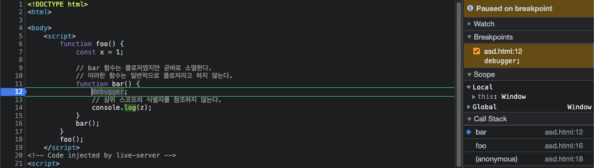

# 엑셀 파일 다운로드 기능 구현

## TL;DR

* api 호출 시 **responseType: 'arraybuffer'** 옵션을 명시하여 받을 response의 형식을 지정해주어야 한다.
* 이렇게 받은 데이터를 다운로드하기 위해선 추가적인 데이터 가공 과정이 필요하다.

정산 관련 페이지를 구현하는 중에 엑셀 다운로드 기능이 필요했다. xlsx 파일을 직접 return하는 api를 용했는데, 이 부분이 s3 링크를 return하는 기존 엑셀 다운로드 api와 다른 점이었다.

이렇게 기존과 다르게 진행하는 이유는 다운로드받을 파일이 임시 성격이 강해 굳이 s3를 거칠 필요가 없는 데이터이기 때문!

그냥 하면 되겠지 했는데 의외로 시간 엄청 잡아 먹어서 다시 공부할 겸 정리해 보고자 한다.

먼저 API 구현부이다.

```jsx
import axios from 'axios';
import { saveAs } from 'file-saver';
import XLSX from 'xlsx';
```

우선 http 요청을 만들기 위한 **axios**, 다운로드한 파일을 저장하기 위한 **file-saver**, 엑셀 파일을 읽거나 만들기 위한 **XLSX**와 같은 필수 모듈을 import한다.

```jsx
export const invoiceExcelDownloadApi = async(invoiceNo) => {
   try {
     const response = await axios({
       method: 'get',
       url: `${process.env.REACT_APP_API_URL}/v2/invoice/customer/excel/${invoiceNo}`,
       responseType: 'arraybuffer',
       headers: {
         Authorization: signToken, // replace with your own authentication token
         'Content-Type': 'application/json',
       },
     });
     // ...
```

이 부분이 엑셀 파일 다운로드를 위한 API 요청을 하는 핵심부이다. 청구서 번호인 invoiceNo를 매개변수로 받고, 이 매개변수는 API의 엔드포인트 URL을 구성한다.

이후 axios를 사용해서 url에 GET 요청을 보내도록 지정하고 **responseType: 'arraybuffer'** 옵션을 포함시켜야 하는데, 이놈이 필요한 이유는 response 데이터가 ArrayBuffer 형식으로 return 되어야 함을 지정하기 위함이다. (ArrayBuffer는 자바스크립트에서 binary data, 즉 엑셀 파일을 나타내는 데에 사용)

아래는 **responseType: 'arraybuffer'** 옵션 포함 여부에 따라 달라지는 response를 보여준다.

<figure><figcaption><p><strong>responseType: 'arraybuffer' 포함</strong></p></figcaption></figure>

<figure><figcaption><p><strong>responseType: 'arraybuffer' 미포함</strong></p></figcaption></figure>

다음으로 요청과 함께 보내는 **headers** 객체에는 요청에 대한 인증 토큰 및 Content-Type이 포함된다. 인증 토큰은 protected된 엔드포인트에 액세스하는 데에 사용되고, Content-Type은 request body에 담아 보낼 데이터의 형식을 지정하는 데에 사용된다.

```jsx
     // ...
     const data = response.data;
     const fileName = `Invoice_${invoiceNo}.xlsx`;
     const workbook = XLSX.read(data, { type: 'array' });
     const fileContent = XLSX.write(workbook, { bookType: 'xlsx', type: 'array' });

     const blob = new Blob([fileContent], { type: 'application/vnd.openxmlformats-officedocument.spreadsheetml.sheet' });
     saveAs(blob, fileName);

     return response;
     // ...
```

이 부분은 api 요청 결과인 response를 다운로드 가능한 엑셀 파일로 변환하는 역할을 한다.

data 변수는 엑셀 파일의 binary 데이터를 ArrayBuffer로 담고 있고, fileName 변수는 다운로드한 파일의 이름으로 사용될 문자열이다.

**XLSX.read**는 ArrayBuffer에서 엑셀 파일 데이터를 읽는 데에 사용된다. 이후 **XLSX.write**를 사용하여 읽어 들인 workbook 변수를 엑셀 파일로 저장할 수 있는 배열로 변환한다.

다음으로 엑셀 파일 컨텐츠를 나타내기 위한 새 **Blob** 객체(blob)를 생성하고, 이 객체는 파일 다운로드 기능을 하는 **file-saver** 모듈의 **savaAs** 함수로 전달된다.

마지막으로 함수는 오리지널 response를 반환한다.

```jsx
   // ...
   } catch (error) {
     console. error(error);
     throw error;
   }
};
```

catch 문 작성해주고 마무리.

> Reference\
> [https://chat.openai.com/chat](https://chat.openai.com/chat)\
> **2023.03.21**
